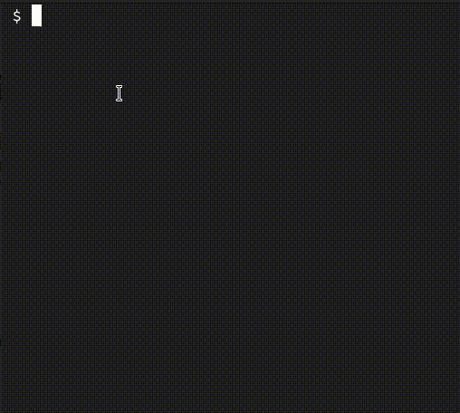

# pss

simple rust 🦀 cli password generator in xkcd style.

## what is a password in xkcd style?


## installation

build it yourself :)

with [rust][rust] and [cargo][cargo] installed just go ahead an clone the
repo and build it:

```bash
git clone https://github.com/bsantanad/pss pss.git
cd pss.git
cargo build --release
```
you might want to copy the `txt` files with the words into that dir
```bash
cp words-en.txt target/release/
cp words-es.txt target/release/
```
If you want, you can make a link to your `/usr/bin`, this way you can use
it from wherever in you system.

For example if you installed it in your home dir, you could do
```bash
ln -sf ~/pss.git/target/release/pss /usr/bin/
```

## usage


## help

```bash
pss 0.1.0
password generator in xkcd style

USAGE:
    pss [FLAGS] [OPTIONS]

FLAGS:
    -h, --help             prints help information
    -c, --special-chars    disable special characters
    -s, --silent           don't list chosen words
    -V, --version          Prints version information

OPTIONS:
    -f, --file <file>    get words from specific file [default: ./words-en.txt]
        --lang <lang>    word language (en, es) [default: en]
    -l, --len <len>      password length in words [default: 4]
```

[rust]: https://doc.rust-lang.org/book/ch01-01-installation.html
[cargo]: https://doc.rust-lang.org/book/ch01-03-hello-cargo.html#building-for-release
